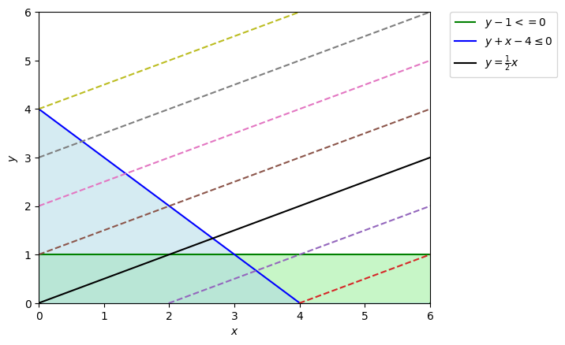
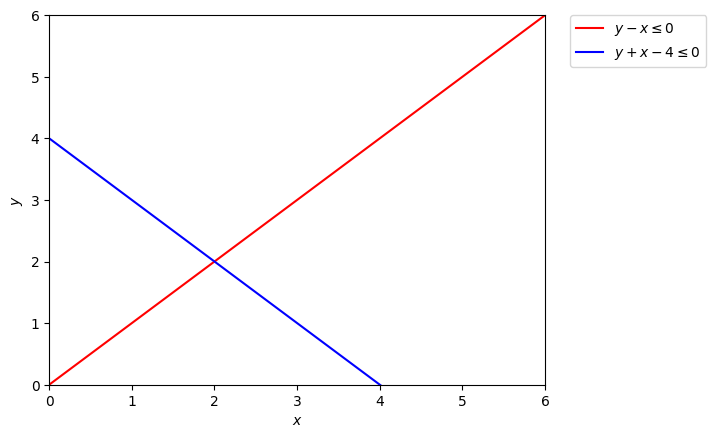

# APA a.a. 22/23 - Programmazione Lineare

Lontani dal caso peggiore: Programmazione Lineare (Compito 3.1 delle note)<br>

## 1. Introduzione
<div style="text-align: justify;">
<p>Il problema della programmazione lineare è un problema di ottimizzazione di una funzione lineare soggetta a vincoli lineari. </p>

<p>Il problema è definito come segue: </p>
</div>

<div style="text-align: center;">


</div>

## 2. Definizione della Regione Ammissibile

<div style="text-align: justify;">
<p>La regione ammissibile è l'insieme dei punti che soddisfano tutti i vincoli. </p>
<p>Con il seguente codice è possibile visualizzare la regione ammissibile del problema affrontato. </p>
</div>


```python
import random
import numpy as np
import matplotlib.pyplot as plt
%matplotlib inline

# Definizione del primo Quadrante
x = np.linspace(0, 10, 100)
y = np.linspace(0, 10, 100)

# Definizione dei vincoli
y1 = x + 0   # Vincolo v1 y -x <= 0
y2 = 0*x + 1 # Vincolo v2 y -1 <= 0
y3 = -x + 4  # Vincolo v3 y + x - 4 <= 0

# Definizione della funzione obiettivo
y4 = 1/2*x

# Plotting
plt.plot(x, y1, label=r'$y - x \leq 0$', color='r')
plt.hlines(y=1, xmin=0, xmax=100, label=r'$y -1 <= 0$', color='g')
plt.plot(x, y3, label=r'$y + x - 4 \leq 0$', color='b')

plt.plot(x, y4, label=r'$y = \frac{1}{2}x$ ', color='k')
for i in range(-5, 5):
    if i != 0:
        plt.plot(x, y4 + i, linestyle='dashed')

plt.xlim(0, 6)
plt.ylim(0, 6)
plt.xlabel(r'$x$')
plt.ylabel(r'$y$')
plt.fill_between(x, 0, np.min([y1, y2, y3], axis=0), color='grey', alpha=0.5, hatch='//', interpolate=True, label=r'$Regione Ammissibile$')
plt.legend(bbox_to_anchor=(1.05, 1), loc=2, borderaxespad=0.)
plt.show()
```
<div style="text-align: center;">


</div>

<div style="text-align: justify;">
<p>La figura mostra la regione ammissibile e le curve di livello della funzione obiettivo.</p>
<p>La regione ammissibile è rappresentata in grigio, mentre le curve di livello della funzione obiettivo O(x, y) = 2*y - x (<font color='black'>Nero</font>) sono rappresentate in modo tratteggiato. </p>
<p>La regione ammissibile è limitata da 3 rette, che sono le seguenti: </p>
<ul>
<li> Vincolo v1: y -x <= 0
<li> Vincolo v2: y -1 <= 0
<li> Vincolo v3: y + x - 4 <= 0
</ul>
</div>
<div style="text-align: justify;">
<p>Come visto a lezione, la regione ammissibile è l'intersezione dei vincoli, il punto massimo si ottiene cercanco la curva di livello che incontra la regione ammissibile nel vertice più alto. </p> 
<p>Nel caso in analisi, il nostro teorico punto più lontato e superiore alla funzione obbiettivo è il punto p(x,y) = (1,1) </p>
</div>

## 3. Risoluzione incrementale - LVIncrementalLP

### 3.1 LVIncrementalLP(v1, v2, v3)
<ul>
<li>Campionamento v1 da {v1,v2,v3}</li>
<li>Campionamento v2 da {v2,v3}</li>
</ul>

### 3.1.1 LVIncrementalLP(v1, v2, v3)
<div style="text-align: justify;">
<p>Il problema può essere risolto in modo incrementale, aggiungendo un vincolo alla volta. </p>
<p>Iniziamo la risoluzione del problema chiamando LVIncrementalLP, che prende in input i vincoli (Figura 3.1.1), LVIncrementalLP(v1, v2, v3), la quale campiona inizialmente v1. (Figura 3.1.2)</p>
</div>

<br>
<div style="text-align: center;"><p>3.1.1 Grafico dei Vincoli</p></div>

<br>
<div style="text-align: center;"><p>3.1.2 Campionamento di v1</p></div>


### 3.1.2 LVIncrementalLP(v2, v3)
<div style="text-align: justify;">
<p>Successivamente, LVIncrementalLP(v2, v3), ricevuto il controllo da LVIncremental(v1, v2, v3), campiona v2. (Figura 3.1.3)</p>
</div>

<br>
<div style="text-align: center;"><p>3.1.3 Campionamento di v2</p></div>

### 3.1.3 LVIncrementalLP(v3)

<div style="text-align: justify;">
<p>Infine, LVIncrementalLP(v3), ricevuto il controllo da LVIncremental(v2, v3), campiona v3 (Figura 3.1.4) e restituisce il massimo X* = inf in quanto la funzione obiettivo non è limitata da v3 come si può notare dal fascio di rette generato dalla stessa.</p>
</div>

<br>
<div style="text-align: center;"><p>3.1.4 Campionamento di v3</p></div>

### 3.1.4 LVIncrementalLP(v2, v3) - Ritorno al passo 3.1.2

<div style="text-align: justify;">
<p>LVIncrementalLP(v2, v3) riceve il controllo da LVIncrementalLP(v3) e campiona v2 (Figura 3.1.5). </p>
<p>Il massimo trovato rimane invariato in quanto soddisfa anche il vincolo v2. </p> 
</div>

<br>
<div style="text-align: center;"><p>3.1.5 Campionamento di v2</p></div>

### 3.1.5 LVIncrementalLP(v1, v2, v3) - Ritorno al passo 3.1.1

<div style="text-align: justify;">
<p>LVIncrementalLP(v1, v2, v3) riceve il controllo da LVIncrementalLP(v2, v3) e campiona v1 (Figura 3.1.6). </p>
<p>Il massimo trovato in precedenza però non soddisfa il vincolo v1, quindi viene aggiornato con il nuovo massimo trovato. </p>
<p>Il nuovo massimo X* è ottenuto confrontando i valori delle curve di livello passanti per i due estremi del segmento definito come l'intersezione tra v1 e v3 sul vincolo v2. </p>
<p>Il nuovo massimo X* è il punto p(x,y) = (1,1)</p>
</div>

<br>
<div style="text-align: center;"><p>3.1.6 Campionamento di v1</p></div>

## 3.2 LVIncrementalLP(v2, v1, v3)

<ul>
<li>Campionamento v2 da {v1,v2,v3}</li>
<li>Campionamento v1 da {v1,v3}</li>
</ul>

### 3.2.1 LVIncrementalLP(v2, v1, v3)
<div style="text-align: justify;">
<p>Iniziamo la risoluzione del problema chiamando LVIncrementalLP, che prende in input i vincoli (Figura 3.2.1), LVIncrementalLP(v2, v1, v3), la quale campiona inizialmente v2. (Figura 3.2.2)</p>
</div>

<br>
<div style="text-align: center;"><p>3.2.1 Grafico dei Vincoli</p></div>

<br>
<div style="text-align: center;"><p>3.2.2 Campionamento di v2</p></div>

### 3.2.2 LVIncrementalLP(v1, v3)
<div style="text-align: justify;">
<p>Successivamente, LVIncrementalLP(v1, v3), ricevuto il controllo da LVIncremental(v2, v1, v3), campiona v1. (Figura 3.2.3)</p>
</div>

<br>
<div style="text-align: center;"><p>3.2.3 Campionamento di v1</p></div>

### 3.2.3 LVIncrementalLP(v3)

<div style="text-align: justify;">
<p>Infine, LVIncrementalLP(v3), ricevuto il controllo da LVIncremental(v1, v3), campiona v3 (Figura 3.2.4) e restituisce il massimo X* = inf in quanto la funzione obiettivo non è limitata da v3 come si può notare dal fascio di rette generato dalla stessa.</p>
</div>

<br>
<div style="text-align: center;"><p>3.2.4 Campionamento di v3</p></div>

### 3.2.4 LVIncrementalLP(v1, v3) - Ritorno al passo 3.2.2

<div style="text-align: justify;">
<p>LVIncrementalLP(v1, v3) riceve il controllo da LVIncrementalLP(v3) e campiona v1 (Figura 3.2.5). </p>
<p>Il massimo trovato precedentemente viola il vincolo v1. Il nuovo massimo X* si ottiene calcolando l'intersezione tra le due rette, ovvero il punto p(x,y) = (2,2) la cui funzione obiettivo è O(2,2) = 2.</p> 
</div>

<br>
<div style="text-align: center;"><p>3.1.5 Campionamento di v1</p></div>

### 3.2.5 LVIncrementalLP(v2, v1, v3) - Ritorno al passo 3.2.1

<div style="text-align: justify;">
<p>LVIncrementalLP(v2, v1, v3) riceve il controllo da LVIncrementalLP(v1, v3) e campiona v1 (Figura 3.2.6). </p>
<p>Il massimo trovato in precedenza però non soddisfa il vincolo v2, quindi viene aggiornato con il nuovo massimo trovato. </p>
<p>Il nuovo massimo X* è ottenuto confrontando i valori delle curve di livello passanti per i due estremi del segmento definito come l'intersezione tra v1, v3 e il vincolo v2. </p>
<p>Il nuovo massimo X* è il punto p(x,y) = (1,1)</p>
</div>

<br>
<div style="text-align: center;"><p>3.2.6 Campionamento di v2</p></div>

## 3.3 Considerazioni

<div style="text-align: justify;">
<p>La soluzione del problema è unica, ma la soluzione incrementale non è unica. </p>
<p>Infatti, sebbene nei due casi le assegnazioni dei valori intermedi del massimo siano nettamente differenti, la soluzione finale è la stessa. </p>
</div>

## 4. Risoluzione con Pulp

<div style="text-align: justify;">
<p>Il problema può essere risolto anche con Pulp, un solver per la programmazione lineare. </p>
<p>In generale Pulp risolve problemi di programmazione lineare minimali, ovvero ricerca il minimo della regione ammissibile. Quindi per usare Pulp nel nostro problema di Massimizzazione dobbiamo o cambiare il segno alla funzione obiettivo oppure settare direttamente Pulp affinchè risolva il problema cercando solamente il massimo.</p>
</div>

```python
import pulp

# Definizione del problema
prob = pulp.LpProblem("Problema", pulp.LpMaximize)

# Definizione delle variabili
x = pulp.LpVariable("x", lowBound=0, cat='Continuous')
y = pulp.LpVariable("y", lowBound=0, cat='Continuous')

# Definizione della funzione obiettivo
prob += 2*y - x

# Definizione dei vincoli
prob += y - x <= 0
prob += y - 1 <= 0
prob += y + x - 4 <= 0

# Risoluzione del problema
prob.solve()

# Stampa dei risultati
print("Status:", pulp.LpStatus[prob.status])

for v in prob.variables():
    print(v.name, "=", v.varValue)

print("Massimo = ", pulp.value(prob.objective))

```

    Status: Optimal
    x = 1.0
    y = 1.0
    Massimo =  1.0


<div style="text-align: justify;">
<p>Il massimo trovato è X* = 1.0, che corrisponde al punto p(x,y) = (1,1) </p>
</div>