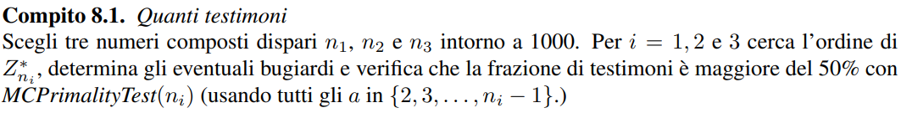

# APA a.a. 22/23 - Test Primalità Monte Carlo

Lontani dal caso peggiore: Test Primalità Monte Carlo (Compito 8.1 delle note)<br>


## Librerie Necessarie


```python
%pip install numpy
%pip install matplotlib
```

## Implementazione Algoritmo


```python
import matplotlib.pyplot as plt
import numpy as np
import random
from random import randint
import math
from math import gcd 
import decimal
```

### Algoritmo Miller-Rabin


```python
def MCPrimalityTest(n, a):
    
    if(n < 3 or (n % 2) == 0):
        return f"{n} NO primo"
    
    s = 0
    q = n - 1

    while q % 2 == 0:
        s += 1
        q //= 2

    x = pow(a, q, n) # a^q mod n

    if x == 1 or x == - 1:
        return f"{a} Bugiardo"
    
    while s - 1 >= 0:
        x = pow(x, 2, n)
        
        if x == 1:
            return f"{a} Bugiardo"
        
        s -= 1
```

### Test di Comprimabilità


```python
def coprime(a, b):
    while b != 0:
        a, b = b, a % b
    return a == 1 # Se a == 1, a e b sono coprimi
```

### Ricerca dell'Ordine di un Elemento


```python
def find_order(n):
    order = 1 # Ordine di Z* di n

    for a in range(1, n):
        if gcd(a, n) == 1: # Se a e n sono coprimi
            result = pow(a, order, n) # Calcolo di a^order (mod n)
            while result != 1:
                result = (result * a) % n # Calcolo di a^order (mod n)
                order += 1

                if order >= n: # Se l'ordine è maggiore o uguale a n
                    return -1
    return order
```

### Ricerca dei Testimoni


```python
def find_witnesses(n): # Trova i testimoni per n
    a = 2
    counter = 0
    witnesses = 0
    for i in range(n - 3):
        if coprime(a, n):
            counter += 1
            result = MCPrimalityTest(n, a) # Applica il test di primalità di Miller-Rabin
            
            if result is not None: # Se il numero è composto
                witnesses += 1 # Aggiungi il numero alla lista dei testimoni

        a += 1
    return witnesses / counter * 100 # Ritorna la percentuale di testimoni
```

### Brute Force per il controllo se un numero è primo


```python
def is_prime(n):
    if n <= 1: # Se n è minore o uguale a 1
        return False

    for i in range(2, n): # Per ogni numero i compreso tra 2 e n
        if n % i == 0:
            return False # Se n è divisibile per i, allora n è composto

    return True # Se n non è divisibile per nessun numero i, allora n è primo
```

### Esecuzione Test


```python
n1 = 999
n2 = 997
n3 = 973

# Calcolo dell'ordine di Z* di n1, n2 e n3
order_n1 = find_order(n1)
order_n2 = find_order(n2)
order_n3 = find_order(n3)

# Calcolo dei testimoni per n1, n2 e n3
rate_witnesses_n1 = find_witnesses(n1)
rate_witnesses_n2 = find_witnesses(n2)
rate_witnesses_n3 = find_witnesses(n3)
```

### Stampa Risultati


```python
print(f"Numero: {n1}")
print(f"Realmente è primo? {is_prime(n1)}")
print(f"Ordine di Z* di {n1}: {order_n1}")
print(f"Frazione di testimoni: {rate_witnesses_n1}")
print(f"")
print(f"Numero: {n2}")
print(f"Realmente è primo? {is_prime(n2)}")
print(f"Ordine di Z* di {n2}: {order_n2}")
print(f"Frazione di testimoni: {rate_witnesses_n2}")
print(f"")
print(f"Numero: {n3}")
print(f"Realmente è primo? {is_prime(n3)}")
print(f"Ordine di Z* di {n3}: {order_n3}")
print(f"Frazione di testimoni: {rate_witnesses_n3}")
```

    Numero: 999
    Realmente è primo? False
    Ordine di Z* di 999: 36
    Frazione di testimoni: 0.30959752321981426
    
    Numero: 997
    Realmente è primo? True
    Ordine di Z* di 997: 996
    Frazione di testimoni: 100.0
    
    Numero: 973
    Realmente è primo? False
    Ordine di Z* di 973: 138
    Frazione di testimoni: 4.116222760290557
    

## Conclusioni

Il test di Miller-Rabin è un test di primalità probabilistico che determina se un dato numero è probabilmente primo. <br>
Il test di Miller-Rabin identifica correttamente che 999 e 973 non sono numeri primi, mentre 997 è un numero primo.<br>

La frazione di testimoni si riferisce alla proporzione di basi per cui il test di Miller-Rabin identifica correttamente un numero composto come composto. <br>
Ad esempio, per il numero 999, la frazione di testimoni è 0.30959752321981426, il che significa che circa il 31% delle basi testate ha correttamente identificato 999 come composto. <br>

In generale, più alta è la frazione di testimoni, più probabile è che il test di Miller-Rabin identifichi correttamente un numero composto come composto. <br>
Per i numeri primi, la frazione di testimoni dovrebbe essere del 100%, poiché tutte le basi dovrebbero identificare correttamente il numero come primo. <br> 
Nei risultati ottenuti, questo è il caso per il numero primo 997.<br>


